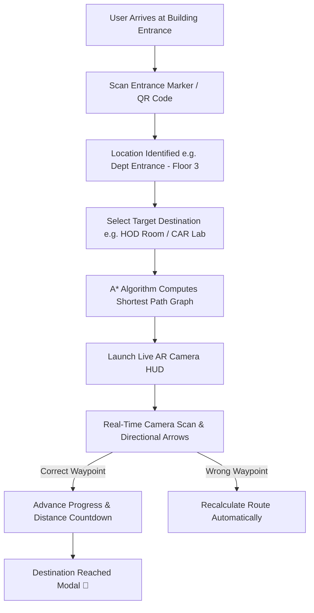

# MGRNav — AR-Powered Indoor Building Navigation System

> **Zero-install, browser-based AR indoor navigation system using ArUco markers and A* pathfinding.**

---

## 📌 Problem Statement & Societal Challenge

Navigating large, multi-story indoor spaces — such as university departments, hospitals, corporate hubs, and government centers — presents severe challenges for visitors, new students, and staff:

* 📡 **Loss of Indoor GPS Signals**: Traditional GPS systems rely on satellite line-of-sight and fail completely inside multi-story concrete structures.
* 🧭 **Confusion & Time Loss**: Visitors frequently waste time searching for specific department offices, laboratories, examination halls, or lifts.
* 🪧 **Static & Inaccessible Signage**: Physical signboards are often outdated, missing, poorly lit, or difficult to follow when transitioning between multiple floors.
* 📱 **Mobile App Fatigue**: Traditional indoor solutions require downloading heavy native applications, creating friction for first-time visitors who only need quick guidance.

---

## 💡 The Solution — MGRNav

**MGRNav** solves indoor navigation by converting any mobile or desktop web browser into an **Augmented Reality (AR) indoor navigation assistant**:

1. **Instant QR / Marker Scanning at Entrances**: Users simply scan an entrance marker to instantly lock onto their starting location without manual setup.
2. **A* Intelligent Routing**: Calculates the shortest and most optimal route across multiple floors, intelligently guiding users through lifts and staircases.
3. **Browser AR Camera Overlay**: Overlays real-time directional arrows (`FORWARD`, `LEFT`, `RIGHT`, `UPSTAIRS`, `DOWNSTAIRS`) directly onto the live camera stream.
4. **Zero Installation Required**: Accessible on any smartphone or tablet directly via the web browser.

---

## ✨ Key Features

* 📷 **Entrance Marker Camera Scanner**: Scan entrance ArUco codes/QRs using your device camera for automatic location lock-on.
* 🗺️ **Multi-Floor A* Pathfinding**: Shortest-path navigation across Ground, 1st, 2nd, and 3rd floors with automatic lift/stair floor-change instructions.
* 🎯 **Augmented Reality Direction HUD**: Live turn-by-turn guidance arrows, distance countdowns, and current waypoint badges overlaid on the camera feed.
* 🔍 **Searchable Destination Directory**: Filter destinations by floor level or search by room names, department labs, and offices.
* 💻 **Built-in Desktop & Mobile Simulator**: Test navigation flows on desktop browsers using interactive simulated marker triggers without needing physical printed markers.
* 🖥️ **Dual System Interface**: Includes both a mobile-responsive Flask Web Application and an OpenCV + Tkinter desktop GUI app.

---

## 🔄 System Architecture & Navigation Workflow



---

## 🛠️ Tech Stack

* **Backend & Core**: Python 3.10, Flask
* **Computer Vision**: OpenCV (`cv2.aruco`) for marker detection and distance estimation
* **Graph Algorithms**: A* Pathfinding (`a_star.py`), Weighted Graph Representation (`graph_map.py`)
* **Front-End**: HTML5, Vanilla CSS3 (Custom Glassmorphism UI), JavaScript WebRTC (`getUserMedia`), Canvas API
* **Desktop GUI**: Tkinter, Threaded OpenCV Video Loop

---

## 📁 Repository Structure

```
MGRNav/
├── README.md                 # Project documentation
├── requirements.txt          # Python dependencies
├── src/
│   ├── app.py                # Main application launcher
│   ├── web_app.py            # Flask Web Application & REST API
│   ├── aruco_detector.py     # Desktop OpenCV ArUco detector loop
│   ├── gui_navigation.py     # Tkinter Desktop GUI
│   ├── a_star.py             # A* shortest path algorithm implementation
│   ├── path_config.py        # Route builder & graph helper
│   ├── graph_map.py          # Building graph nodes & edge weights
│   ├── sample_map.py         # Marker location names & floor mappings
│   ├── direction_calculator.py# Distance & turn angle calculator
│   ├── generate_marker.py    # Utility script to generate ArUco markers
│   └── templates/
│       └── index.html        # Responsive web app UI & AR HUD
├── Data/                     # Map configuration data
└── markers/                  # Generated printable ArUco marker PNGs
```

---

## 🚀 Getting Started

### 1. Prerequisites
- **Python 3.10+** installed on your system.
- Web camera or laptop camera for ArUco marker scanning.

### 2. Installation

Clone the repository:
```bash
git clone https://github.com/your-username/MGRNav.git
cd MGRNav
```

Set up a virtual environment and install dependencies:
```bash
python -m venv venv
# On Windows:
venv\Scripts\activate
# On Linux/macOS:
source venv/bin/activate

pip install -r requirements.txt
```

---

### 3. Running the Web Application (Recommended)

To launch the mobile-friendly web navigation system:
```bash
python src/web_app.py
```
Open your browser and navigate to:
```
http://127.0.0.1:5000
```

---

### 4. Running the Desktop GUI Application

To launch the desktop camera scanner with Tkinter GUI:
```bash
python src/aruco_detector.py
```

---

### 5. Generating Printable ArUco Markers

To generate printable ArUco markers (`DICT_4X4_50` dictionary) for physical deployment in building hallways:
```bash
python src/generate_marker.py
```
Generated PNG images will be saved inside the `markers/` directory.

---

## 📜 Building Map & Marker Mapping

| Marker ID | Location Name | Floor Level | Type |
| :--- | :--- | :--- | :--- |
| `0` | Sunjava | Floor 3 | Waypoint |
| `1` | Dept Entrance | Floor 3 | Entrance / Waypoint |
| `2` | 3rd Lift Entry | Floor 3 | Elevator Transition |
| `3` | Staff Cabin | Floor 3 | Room |
| `4` | HOD Room | Floor 3 | Office |
| `5` | Dept Office | Floor 3 | Office |
| `6` | Digital Resource Centre (DRC) | Floor 2 | Lab |
| `7` | 2nd Lift Entry | Floor 2 | Elevator Transition |
| `8` | 1st Lift Entry | Floor 1 | Elevator Transition |
| `9` | Ground Floor Lift | Floor 0 | Elevator Transition |
| `10` | Stairs Third Floor | Floor 3 | Staircase Transition |
| `11` | Stairs Ground Floor | Floor 0 | Staircase Transition |
| `12` | Internet Lab | Floor 2 | Lab |
| `13` | Admission Office | Floor 0 | Office |
| `14` | Register Office | Floor 0 | Office |
| `15` | Controller Of Examination Office | Floor 2 | Office |
| `16` | CAR Lab | Floor 2 | Research Lab |
| `17` | Dept of ECE | Floor 1 | Department |
| `18` | Dept of AIDS | Floor 1 | Department |
| `19` | Dept of CSE | Floor 1 | Department |
| `20` | Chancellor Room | Floor 0 | Executive Office |

---

## 🤝 Contributing

Contributions, issues, and feature requests are welcome! Feel free to check the issues page or submit a pull request.

---

## 📄 License

Distributed under the MIT License. See `LICENSE` for more information.
